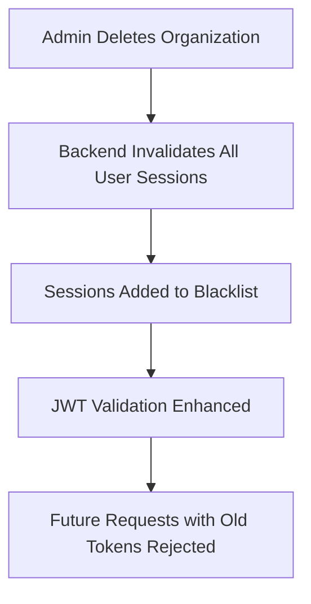

# 🗑️ ORGANIZATION DELETION GUIDE FOR FRONTEND ENGINEERS

## 🎯 **OVERVIEW**

The backend now supports **organization deletion** with proper security and confirmation mechanisms. This guide shows frontend engineers exactly how to implement organization deletion in their applications.

---

## 🔗 **AVAILABLE DELETION ENDPOINTS**

### 1. **DELETE /admin/organizations/{id}** - Full Deletion
**Purpose:** Permanently delete organization and ALL related data  
**Security Level:** 🔴 DANGEROUS - Cannot be undone  
**Auth Required:** ✅ Admin JWT token (organization admin only)

### 2. **PUT /admin/organizations/{id}/soft-delete** - Soft Deletion  
**Purpose:** Mark organization as inactive (preserves data)  
**Security Level:** 🟡 SAFER - Data preserved, can be reactivated  
**Auth Required:** ✅ Admin JWT token (organization admin only)

---

## 🔴 **FULL DELETION ENDPOINT**

### **DELETE /admin/organizations/{id}**

#### **Two-Phase Process:**
1. **Phase 1:** Preview what will be deleted (no confirmation)
2. **Phase 2:** Actual deletion (requires confirmation)

#### **Phase 1: Deletion Preview**
```javascript
// Get preview of what will be deleted
const getDeletePreview = async (orgId, adminToken) => {
  const response = await fetch(`${API_BASE_URL}/admin/organizations/${orgId}`, {
    method: 'DELETE',
    headers: {
      'Authorization': `Bearer ${adminToken}`,
      'Content-Type': 'application/json'
    },
    body: JSON.stringify({})  // Empty body = preview mode
  });
  
  return await response.json();
};

// Example response:
{
  "success": true,
  "data": {
    "organization": {
      "org_id": "abc-123",
      "name": "My University",
      "description": "...",
      // ... other org details
    },
    "deletion_preview": {
      "users_to_delete": 25,
      "sessions_to_delete": 12,
      "attendance_records_to_delete": 150
    },
    "warning": "This action cannot be undone!"
  },
  "message": "Deletion preview. Send 'confirm_deletion': true to proceed."
}
```

#### **Phase 2: Actual Deletion**
```javascript
// Actually delete the organization
const deleteOrganization = async (orgId, adminToken) => {
  const response = await fetch(`${API_BASE_URL}/admin/organizations/${orgId}`, {
    method: 'DELETE',
    headers: {
      'Authorization': `Bearer ${adminToken}`,
      'Content-Type': 'application/json'
    },
    body: JSON.stringify({
      confirm_deletion: true  // Required for actual deletion
    })
  });
  
  return await response.json();
};

// Example success response:
{
  "success": true,
  "data": {
    "organization": 1,
    "users": 25,
    "attendance_sessions": 12,
    "attendance_records": 150,
    "user_sessions": 30
  },
  "message": "Organization 'My University' and all related data deleted successfully"
}
```

---

## 🟡 **SOFT DELETION ENDPOINT**

### **PUT /admin/organizations/{id}/soft-delete**

```javascript
// Safely deactivate organization (preserves data)
const softDeleteOrganization = async (orgId, adminToken) => {
  const response = await fetch(`${API_BASE_URL}/admin/organizations/${orgId}/soft-delete`, {
    method: 'PUT',
    headers: {
      'Authorization': `Bearer ${adminToken}`,
      'Content-Type': 'application/json'
    }
  });
  
  return await response.json();
};

// Example response:
{
  "success": true,
  "data": {
    "org_id": "abc-123",
    "name": "My University",
    "is_active": false,  // ← Now inactive
    "updated_at": "2025-07-09T17:15:00Z"
    // ... other org details
  },
  "message": "Organization deactivated successfully. Data preserved."
}
```

---

## 🔒 **NEW SECURITY ENHANCEMENTS** ⭐

### **🚨 IMPORTANT SECURITY UPDATE**
**As of July 9, 2025**, the backend has implemented critical security enhancements in response to frontend team recommendations:

#### **✅ What's New:**
1. **🔐 Session Invalidation**: All user sessions are automatically invalidated when an organization is deleted or deactivated
2. **🛡️ Enhanced JWT Validation**: Tokens are validated against organization existence in real-time
3. **📝 Audit Trail**: All session invalidations are logged for security monitoring
4. **🚫 Session Blacklisting**: Invalidated sessions cannot be reused

#### **🔒 Security Flow:**


#### **📊 Updated Response Format:**
Organization deletion now returns additional security information:

```javascript
// NEW: Enhanced deletion response
{
  "success": true,
  "data": {
    "organization": 1,
    "users": 25,
    "attendance_sessions": 12,
    "attendance_records": 150,
    "user_sessions": 30,
    "invalidated_sessions": 30  // ← NEW: Sessions invalidated
  },
  "message": "Organization deleted and all user sessions invalidated"
}

// NEW: Enhanced soft-delete response
{
  "success": true,
  "data": {
    "org_id": "abc-123",
    "name": "My University",
    "is_active": false,
    "updated_at": "2025-07-09T17:15:00Z",
    "invalidated_sessions": 15  // ← NEW: Sessions invalidated
  },
  "message": "Organization deactivated. All user sessions invalidated."
}
```

#### **🎯 Impact on Frontend:**
- **Users from deleted organizations are immediately logged out**
- **Old JWT tokens become invalid instantly**
- **No manual session cleanup required**
- **Enhanced security prevents orphaned access**

#### **⚠️ Important for Frontend Developers:**
```javascript
// Handle automatic logout scenarios
const apiCall = async (endpoint, token) => {
  try {
    const response = await fetch(endpoint, {
      headers: { 'Authorization': `Bearer ${token}` }
    });
    
    if (response.status === 401) {
      // Token invalidated (possibly due to org deletion)
      localStorage.removeItem('token');
      window.location.href = '/login';
      alert('Your session has expired. Please log in again.');
    }
    
    return response;
  } catch (error) {
    console.error('API call failed:', error);
  }
};
```

---

## 🔒 **SECURITY & PERMISSIONS**

### **Who Can Delete Organizations:**
- ✅ **Organization Admins** - Can delete/deactivate their own organization only
- ❌ **Regular Users** - Cannot delete organizations
- ❌ **Cross-Organization** - Admin from Org A cannot delete Org B

### **Security Checks:**
```javascript
// The backend automatically validates:
// 1. User has admin role
// 2. User belongs to the organization being deleted
// 3. JWT token is valid and not expired

// If security check fails:
{
  "success": false,
  "message": "You can only delete your own organization",
  "error": "403 Forbidden"
}
```

---

## 🎨 **FRONTEND IMPLEMENTATION EXAMPLES**

### **React/JavaScript Example:**

```jsx
import React, { useState } from 'react';

const OrganizationDeleteButton = ({ organization, adminToken, onDeleted }) => {
  const [showConfirmation, setShowConfirmation] = useState(false);
  const [deletePreview, setDeletePreview] = useState(null);
  const [isLoading, setIsLoading] = useState(false);

  // Step 1: Get deletion preview
  const handleDeleteClick = async () => {
    setIsLoading(true);
    try {
      const preview = await getDeletePreview(organization.org_id, adminToken);
      setDeletePreview(preview.data);
      setShowConfirmation(true);
    } catch (error) {
      alert('Failed to get deletion preview: ' + error.message);
    }
    setIsLoading(false);
  };

  // Step 2: Confirm and execute deletion
  const handleConfirmDelete = async () => {
    setIsLoading(true);
    try {
      const result = await deleteOrganization(organization.org_id, adminToken);
      alert('Organization deleted successfully!');
      onDeleted(organization.org_id);
    } catch (error) {
      alert('Failed to delete organization: ' + error.message);
    }
    setIsLoading(false);
    setShowConfirmation(false);
  };

  // Step 3: Soft delete alternative
  const handleSoftDelete = async () => {
    setIsLoading(true);
    try {
      const result = await softDeleteOrganization(organization.org_id, adminToken);
      alert('Organization deactivated successfully!');
      onDeleted(organization.org_id);
    } catch (error) {
      alert('Failed to deactivate organization: ' + error.message);
    }
    setIsLoading(false);
  };

  return (
    <div>
      {!showConfirmation ? (
        <div>
          <button 
            onClick={handleDeleteClick}
            disabled={isLoading}
            className="btn-danger"
          >
            {isLoading ? 'Loading...' : '🗑️ Delete Organization'}
          </button>
          
          <button 
            onClick={handleSoftDelete}
            disabled={isLoading}
            className="btn-warning"
          >
            {isLoading ? 'Loading...' : '📦 Deactivate Organization'}
          </button>
        </div>
      ) : (
        <div className="confirmation-dialog">
          <h3>⚠️ Confirm Organization Deletion</h3>
          <p><strong>Organization:</strong> {deletePreview?.organization?.name}</p>
          <p><strong>This will permanently delete:</strong></p>
          <ul>
            <li>{deletePreview?.deletion_preview?.users_to_delete} users</li>
            <li>{deletePreview?.deletion_preview?.sessions_to_delete} attendance sessions</li>
            <li>{deletePreview?.deletion_preview?.attendance_records_to_delete} attendance records</li>
          </ul>
          <p className="warning">⚠️ This action cannot be undone!</p>
          
          <div>
            <button 
              onClick={handleConfirmDelete}
              disabled={isLoading}
              className="btn-danger"
            >
              {isLoading ? 'Deleting...' : '✅ Yes, Delete Everything'}
            </button>
            
            <button 
              onClick={() => setShowConfirmation(false)}
              className="btn-secondary"
            >
              ❌ Cancel
            </button>
          </div>
        </div>
      )}
    </div>
  );
};

// Helper functions
const getDeletePreview = async (orgId, adminToken) => {
  const response = await fetch(`${API_BASE_URL}/admin/organizations/${orgId}`, {
    method: 'DELETE',
    headers: {
      'Authorization': `Bearer ${adminToken}`,
      'Content-Type': 'application/json'
    },
    body: JSON.stringify({})
  });
  
  if (!response.ok) {
    throw new Error(`HTTP ${response.status}`);
  }
  
  return await response.json();
};

const deleteOrganization = async (orgId, adminToken) => {
  const response = await fetch(`${API_BASE_URL}/admin/organizations/${orgId}`, {
    method: 'DELETE',
    headers: {
      'Authorization': `Bearer ${adminToken}`,
      'Content-Type': 'application/json'
    },
    body: JSON.stringify({ confirm_deletion: true })
  });
  
  if (!response.ok) {
    throw new Error(`HTTP ${response.status}`);
  }
  
  return await response.json();
};

const softDeleteOrganization = async (orgId, adminToken) => {
  const response = await fetch(`${API_BASE_URL}/admin/organizations/${orgId}/soft-delete`, {
    method: 'PUT',
    headers: {
      'Authorization': `Bearer ${adminToken}`,
      'Content-Type': 'application/json'
    }
  });
  
  if (!response.ok) {
    throw new Error(`HTTP ${response.status}`);
  }
  
  return await response.json();
};
```

### **Flutter/Dart Example:**

```dart
import 'dart:convert';
import 'package:http/http.dart' as http;

class OrganizationService {
  static const String baseUrl = 'https://attendance-backend-go8h.onrender.com';
  
  // Get deletion preview
  static Future<Map<String, dynamic>> getDeletePreview(String orgId, String adminToken) async {
    final response = await http.delete(
      Uri.parse('$baseUrl/admin/organizations/$orgId'),
      headers: {
        'Authorization': 'Bearer $adminToken',
        'Content-Type': 'application/json',
      },
      body: jsonEncode({}),
    );
    
    if (response.statusCode != 200) {
      throw Exception('Failed to get deletion preview: ${response.statusCode}');
    }
    
    return jsonDecode(response.body);
  }
  
  // Delete organization with confirmation
  static Future<Map<String, dynamic>> deleteOrganization(String orgId, String adminToken) async {
    final response = await http.delete(
      Uri.parse('$baseUrl/admin/organizations/$orgId'),
      headers: {
        'Authorization': 'Bearer $adminToken',
        'Content-Type': 'application/json',
      },
      body: jsonEncode({'confirm_deletion': true}),
    );
    
    if (response.statusCode != 200) {
      throw Exception('Failed to delete organization: ${response.statusCode}');
    }
    
    return jsonDecode(response.body);
  }
  
  // Soft delete organization
  static Future<Map<String, dynamic>> softDeleteOrganization(String orgId, String adminToken) async {
    final response = await http.put(
      Uri.parse('$baseUrl/admin/organizations/$orgId/soft-delete'),
      headers: {
        'Authorization': 'Bearer $adminToken',
        'Content-Type': 'application/json',
      },
    );
    
    if (response.statusCode != 200) {
      throw Exception('Failed to soft delete organization: ${response.statusCode}');
    }
    
    return jsonDecode(response.body);
  }
}

// Usage in a Flutter widget:
class DeleteOrganizationButton extends StatefulWidget {
  final Map<String, dynamic> organization;
  final String adminToken;
  final Function(String) onDeleted;
  
  const DeleteOrganizationButton({
    Key? key,
    required this.organization,
    required this.adminToken,
    required this.onDeleted,
  }) : super(key: key);
  
  @override
  _DeleteOrganizationButtonState createState() => _DeleteOrganizationButtonState();
}

class _DeleteOrganizationButtonState extends State<DeleteOrganizationButton> {
  bool isLoading = false;
  Map<String, dynamic>? deletePreview;
  
  Future<void> _getDeletePreview() async {
    setState(() => isLoading = true);
    
    try {
      final preview = await OrganizationService.getDeletePreview(
        widget.organization['org_id'],
        widget.adminToken,
      );
      
      setState(() => deletePreview = preview['data']);
      _showConfirmationDialog();
    } catch (e) {
      _showError('Failed to get deletion preview: $e');
    }
    
    setState(() => isLoading = false);
  }
  
  Future<void> _confirmDelete() async {
    setState(() => isLoading = true);
    
    try {
      await OrganizationService.deleteOrganization(
        widget.organization['org_id'],
        widget.adminToken,
      );
      
      widget.onDeleted(widget.organization['org_id']);
      _showSuccess('Organization deleted successfully!');
    } catch (e) {
      _showError('Failed to delete organization: $e');
    }
    
    setState(() => isLoading = false);
  }
  
  @override
  Widget build(BuildContext context) {
    return Column(
      children: [
        ElevatedButton.icon(
          onPressed: isLoading ? null : _getDeletePreview,
          icon: Icon(Icons.delete_forever),
          label: Text(isLoading ? 'Loading...' : 'Delete Organization'),
          style: ElevatedButton.styleFrom(backgroundColor: Colors.red),
        ),
        SizedBox(height: 8),
        ElevatedButton.icon(
          onPressed: isLoading ? null : _softDelete,
          icon: Icon(Icons.archive),
          label: Text('Deactivate Organization'),
          style: ElevatedButton.styleFrom(backgroundColor: Colors.orange),
        ),
      ],
    );
  }
  
  void _showConfirmationDialog() {
    showDialog(
      context: context,
      builder: (context) => AlertDialog(
        title: Text('⚠️ Confirm Deletion'),
        content: Column(
          mainAxisSize: MainAxisSize.min,
          crossAxisAlignment: CrossAxisAlignment.start,
          children: [
            Text('Organization: ${deletePreview?['organization']?['name']}'),
            SizedBox(height: 16),
            Text('This will permanently delete:'),
            Text('• ${deletePreview?['deletion_preview']?['users_to_delete']} users'),
            Text('• ${deletePreview?['deletion_preview']?['sessions_to_delete']} sessions'),
            Text('• ${deletePreview?['deletion_preview']?['attendance_records_to_delete']} records'),
            SizedBox(height: 16),
            Text('⚠️ This action cannot be undone!', 
                 style: TextStyle(color: Colors.red, fontWeight: FontWeight.bold)),
          ],
        ),
        actions: [
          TextButton(
            onPressed: () => Navigator.pop(context),
            child: Text('Cancel'),
          ),
          ElevatedButton(
            onPressed: () {
              Navigator.pop(context);
              _confirmDelete();
            },
            style: ElevatedButton.styleFrom(backgroundColor: Colors.red),
            child: Text('Delete Everything'),
          ),
        ],
      ),
    );
  }
}
```

---

## ❌ **ERROR HANDLING**

### **Common Error Responses:**

#### **401 Unauthorized - Invalid/Expired Token**
```json
{
  "success": false,
  "message": "Token expired or invalid",
  "error": "unauthorized"
}
```

#### **403 Forbidden - Not Organization Admin**
```json
{
  "success": false,
  "message": "You can only delete your own organization",
  "error": "forbidden"
}
```

#### **404 Not Found - Organization Doesn't Exist**
```json
{
  "success": false,
  "message": "Organization not found",
  "error": "not_found"
}
```

#### **500 Server Error - Backend Issue**
```json
{
  "success": false,
  "message": "Failed to delete organization: Database error",
  "error": "server_error"
}
```

### **Error Handling in Code:**
```javascript
const handleDeleteWithErrorHandling = async (orgId, adminToken) => {
  try {
    const result = await deleteOrganization(orgId, adminToken);
    
    if (result.success) {
      alert('Organization deleted successfully!');
    } else {
      throw new Error(result.message);
    }
  } catch (error) {
    if (error.message.includes('401')) {
      alert('Your session has expired. Please log in again.');
      // Redirect to login
    } else if (error.message.includes('403')) {
      alert('You can only delete your own organization.');
    } else if (error.message.includes('404')) {
      alert('Organization not found.');
    } else {
      alert('Failed to delete organization: ' + error.message);
    }
  }
};
```

---

## 📱 **UX RECOMMENDATIONS**

### **1. Two-Step Confirmation Process:**
```
User clicks "Delete" → Show preview → Confirm → Execute deletion
```

### **2. Clear Visual Warnings:**
- Use red color for dangerous actions
- Show warning icons (⚠️)
- Display exactly what will be deleted
- Emphasize "cannot be undone"

### **3. Provide Alternatives:**
- Offer soft deletion as safer option
- Allow data export before deletion
- Suggest organization transfer instead

### **4. Loading States:**
- Show loading indicators during preview
- Disable buttons during operations
- Provide progress feedback

### **5. Success/Error Feedback:**
- Clear success messages
- Helpful error messages with next steps
- Auto-redirect after successful deletion

---

## 🧪 **TESTING CHECKLIST**

Before deploying, test these scenarios:

### **✅ Success Cases:**
- [ ] Admin can get deletion preview
- [ ] Admin can delete their own organization
- [ ] Admin can soft delete their organization
- [ ] All related data is properly deleted
- [ ] Success messages are shown

### **✅ Security Cases:**
- [ ] Regular users cannot delete organizations
- [ ] Admin cannot delete other organizations
- [ ] Invalid tokens are rejected
- [ ] Expired tokens are rejected
- [ ] **🔐 NEW: Sessions invalidated on organization deletion**
- [ ] **🔐 NEW: Sessions invalidated on organization soft-delete**
- [ ] **🔐 NEW: Old tokens rejected after organization deletion**
- [ ] **🔐 NEW: JWT validation includes organization existence check**

### **✅ Error Cases:**
- [ ] Non-existent organization returns 404
- [ ] Missing confirmation returns preview
- [ ] Network errors are handled gracefully
- [ ] Server errors show appropriate messages

---

## 🔗 **ENDPOINT SUMMARY**

| Endpoint | Method | Purpose | Auth | Data Required |
|----------|---------|---------|------|---------------|
| `/admin/organizations/{id}` | DELETE | Get deletion preview | Admin JWT | `{}` (empty body) |
| `/admin/organizations/{id}` | DELETE | Delete organization | Admin JWT | `{"confirm_deletion": true}` |
| `/admin/organizations/{id}/soft-delete` | PUT | Deactivate organization | Admin JWT | None |

### **Base URLs:**
- **Production:** `https://attendance-backend-go8h.onrender.com`
- **Development:** `http://127.0.0.1:5000`

---

## 💡 **BEST PRACTICES**

1. **Always show preview first** - Let users see impact before deletion
2. **Require explicit confirmation** - Don't make deletion too easy
3. **Provide soft delete option** - Give users a safer alternative
4. **Handle errors gracefully** - Show helpful error messages
5. **Use loading states** - Keep users informed during operations
6. **Test thoroughly** - Verify all security and error scenarios

---

**🎉 The organization deletion feature is now fully implemented and ready for frontend integration!**
